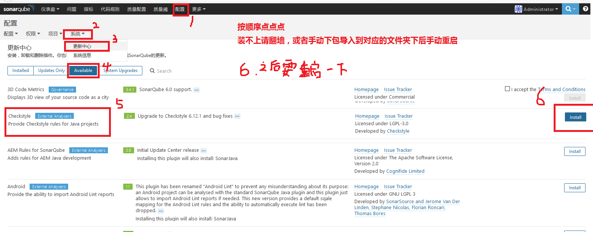
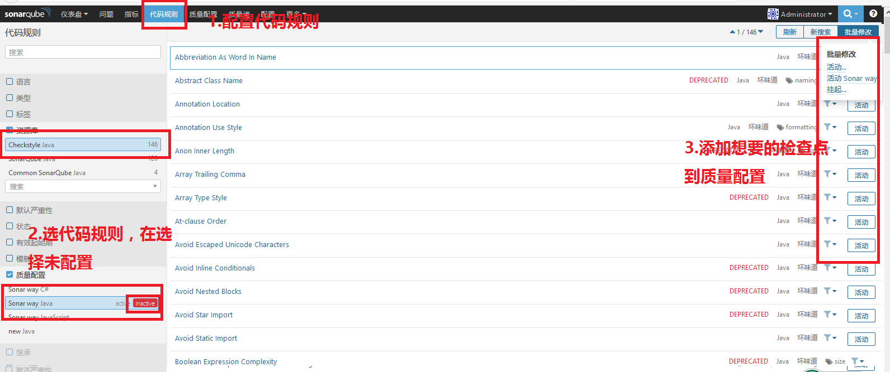
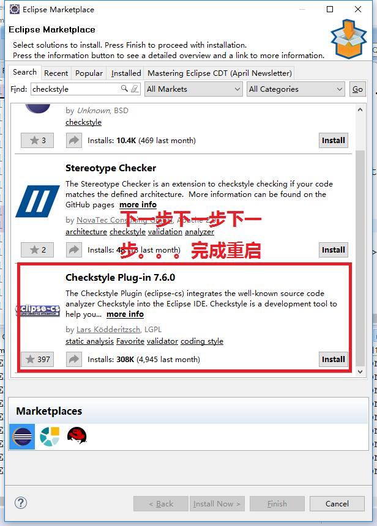
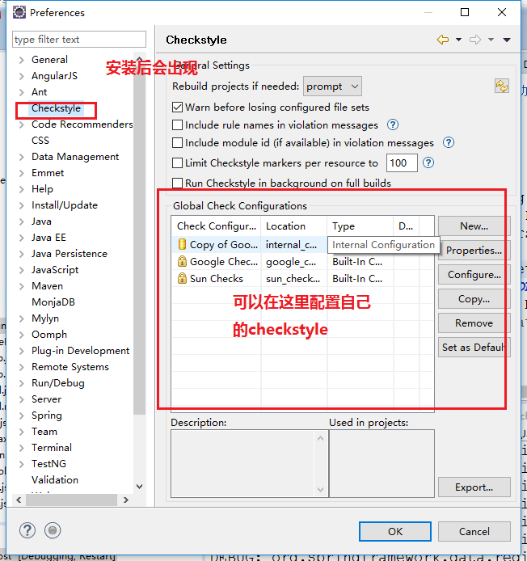
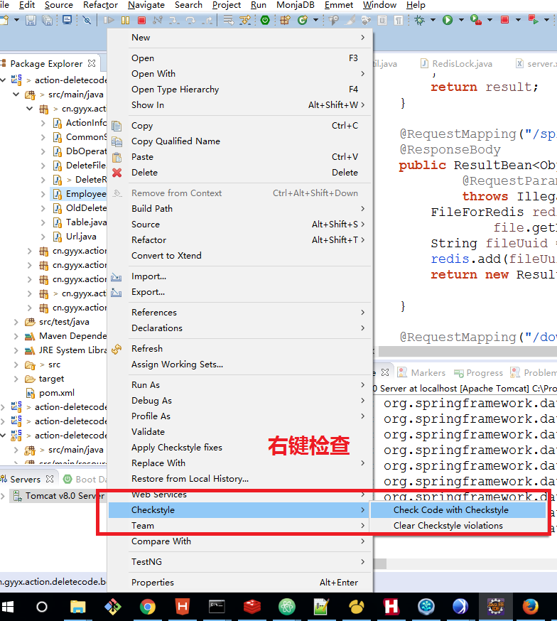
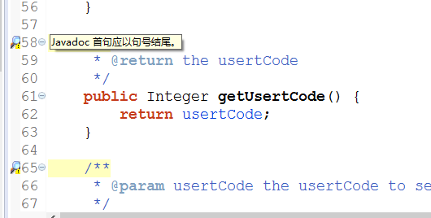
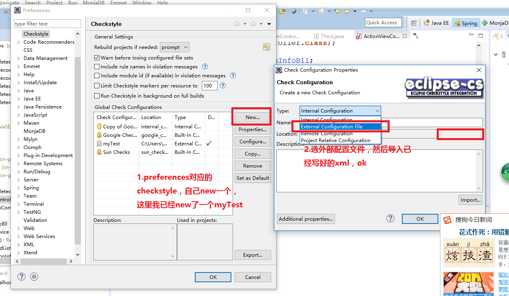
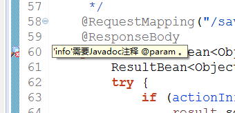
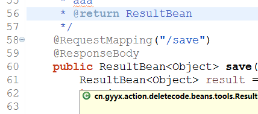

# checkStyle
## for sonarQube
1. 首先要下载checkstyle插件  
install,上图，不多说。    
  
手动安装：将下载的jar包放到`\extensions\plugins`下，手动重启。  
2. 配置规则，可以把想要的检查点配置进质量配置  
  
3. 可以检查我们的代码了。

## for eclipse  
1. 去搜索
  
2. 重启后在Preferences里面可以配置自己的checkstyle  
  
3. 右键检查
    
4. 然后就可以看到结果了  


## 自定义xml配置文件
1. 大致结构：
```
<?xml version="1.0"?>
<!DOCTYPE module PUBLIC
    "-//Puppy Crawl//DTD Check Configuration 1.2//EN"
    "http://www.puppycrawl.com/dtds/configuration_1_2.dtd">
<module name="Checker">
    <!-- 全局的警告级别 -->
    <property name="severity" value="error"/>
    <property name="charset" value="UTF-8"/>
    <!-- 一般都会有的模块 相当于一个集合，里面包含若干件检查子模块 -->
    <module name="TreeWalker">
        <!--子模块 ，这里举的例子是javaDoc的 -->
        <module name="JavadocMethod">
            <!-- 配置参数，不配置的都使用默认参数，详情请自己去看API文档 -->
            <property name="allowMissingParamTags" value="true"/>
        </module>
    </module>
</module>
```
在这里，除了TreeWalker以外，还有其他的模块与之并列。原文是这么介绍的：  
A Checkstyle configuration specifies which modules to plug in and apply to Java source files. Modules are structured in a tree whose root is the Checker module. The next level of modules contains:  
FileSetChecks - modules that take a set of input files and fire error messages.
Filters - modules that filter audit events, including error messages, for acceptance.
AuditListeners - modules that report accepted events.
Many checks are submodules of the TreeWalker FileSetCheck module. The TreeWalker operates by separately transforming each of the Java source files into an abstract syntax tree and then handing the result over to each of its submodules which in turn have a look at certain aspects of the tree.  
Checkstyle obtains a configuration from an XML document whose elements specify the configuration's hierarchy of modules and their properties. You provide a file that contains the configuration document when you invoke Checkstyle at the command line, and when you run a Checkstyle task in ant. The documentation directory of the Checkstyle distribution contains a sample configuration file sun_checks.xml which configures Checkstyle to check for the Sun coding conventions.    
大致翻译一下就是有一些filter 和 listener和 TreeWalker fileSetChecks 并列的意思吧，大多数的检查点都是在treewalker中的，具体哪个放在哪里，可以去看API.

2. eclipse中導入配置文件  
配置文件我就用的上面的xml代码。  
导入自定义规则：
  
之后再对文件进行检查(检查方法见上面的介绍)。  
结果1：配置文件没有`  <property name="allowMissingParamTags" value="true"/>`这句  
  
结果2：配置文件有`  <property name="allowMissingParamTags" value="true"/>`这句  
  
可以看到结果1没有配置允许javaDoc参数为空（默认为不允许），出现了检查出的错误。结果2加上了允许javaDoc参数为空的配置，检查结果中错误消失了。
